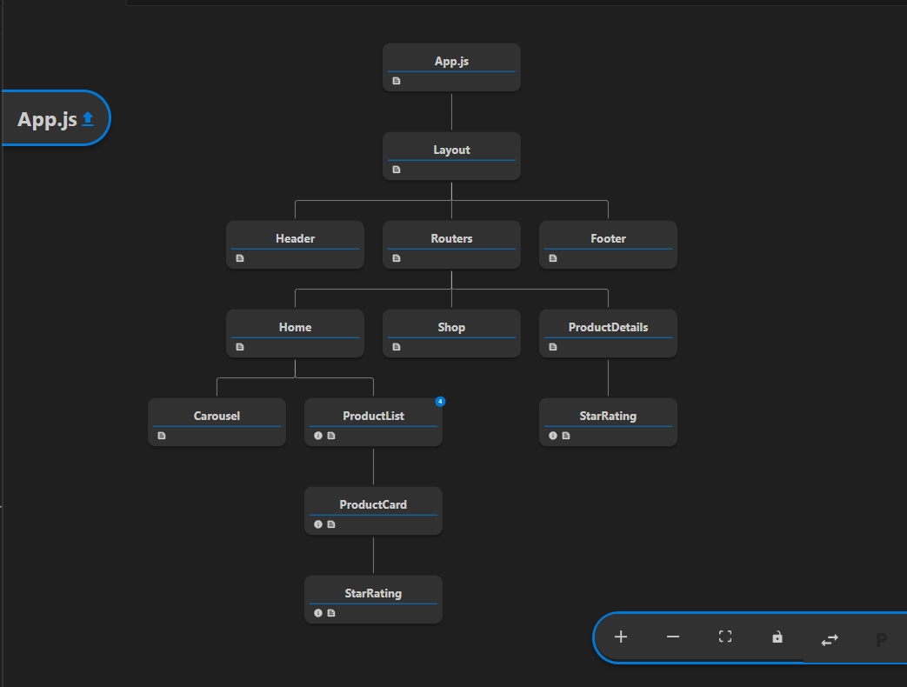

# Client

# Package installation

`npm i axios redux react-redux redux-thunk react-router-dom @redux-devtools/extension react-helmet react-icons`

# scss setup

https://github.com/manishsinghraj/learn-sass

- create folder `assets` in src
- `assets` > `scss` > `global Folder` - `_index.scss`, `_boilerplate.scss`
- `assets` > `scss` > `utils Folder` - `_index.scss`, `_font.scss`
- `assets` > `scss` > `style.scss`

watch scss and build it

`import './build/style.css'` in App.js

# pages

- create Home.js
- create Shop.js
- create ProductDetails.js

# components

- create components folder
- create header folder - Header.js
- create footer folder - Footer.js
- create layout folder - Layout.js
- creater home Folder - 
    - Carousel.js
    - ProductList.js
    - ProductCard.js
    - StarRating.js

# router

- create router folder
- create Route.js - link all pages and create path.

# connect

- App.js add Layout.js component 

# redux

- create Banner Folder - 
    - bannerAction.js
    - bannerReducer.js
    - bannerTypes.js

- create store.js

 

 

# HOME

1. # Banner (Carousel)
2. # Product Listing

# PRODUCT-DETAILS
